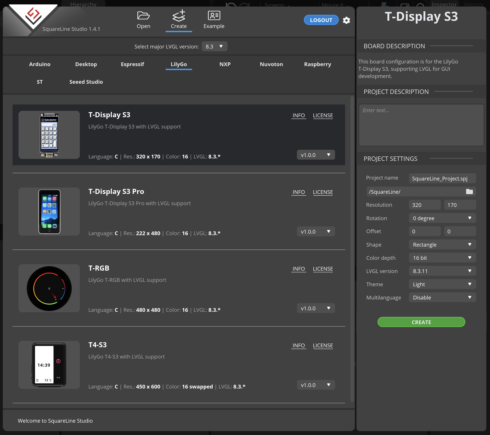

# T-Display-S3-Pro Open Board Platform (OBP)



https://docs.squareline.io/docs/obp/ 

The board package files should be copied to the following path:

- Windows: ```C:\Users\USERNAME\Documents\SquareLine\boards```
- Linux: ```~/SquareLine/boards```
- MacOS: ```Users\USERNAME\SquareLine\boards```